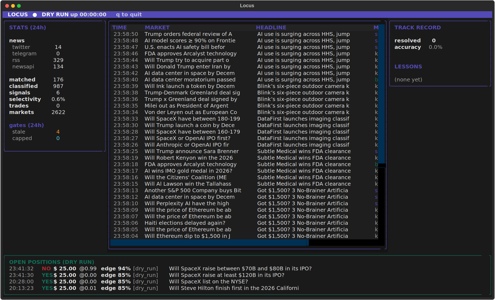

# Locus

Locus is an autonomous agent that reads breaking news, classifies it with Claude, and trades niche Polymarket markets.

```
Breaking News (Twitter / Telegram / RSS)
        ↓ (< 5 seconds)
Match to niche markets (< $500K volume)
        ↓
Claude Classification: bullish / bearish / neutral + materiality + confidence
        ↓
Edge detection → risk gates (freshness · headline cap · correlation · orderbook)
        ↓
Confidence-based half-Kelly sizing
        ↓
Instant execution → SQLite log → calibration tracking
```

## What Changed From V1

V1 scraped RSS feeds (5-60 min delay), asked Claude "what's the probability?" (wrong question for LLMs), and competed on high-volume markets (where every bot already operates).

V2 inverts all three:
- **Speed**: Real-time Twitter/Telegram streams instead of stale RSS
- **Classification**: Claude classifies "bullish or bearish?" instead of estimating probability — a task LLMs are actually good at
- **Niche markets**: Only trades markets under $500K volume where the crowd is small and slow

---

## Setup (2 minutes)

### One-Command Setup

```bash
git clone https://github.com/locus-agent/Locus.git
cd Locus
bash setup.sh
```

### Manual Setup

```bash
git clone https://github.com/locus-agent/Locus.git
cd Locus
python3 -m venv .venv
source .venv/bin/activate
pip install -r requirements.txt
cp .env.example .env
```

Add your keys to `.env`:

```
ANTHROPIC_API_KEY=sk-ant-...         # Required
TWITTER_BEARER_TOKEN=...             # Optional — real-time news stream
TELEGRAM_BOT_TOKEN=...               # Optional — channel monitoring
POLYMARKET_API_KEY=...               # Optional — live trading only
```

### Verify

```bash
python cli.py verify
```

---

## How to Use

### Event-Driven Pipeline

```bash
# Start the real-time pipeline — monitors news streams, classifies, trades
python cli.py watch

# Enable live trading
python cli.py watch --live
```

The `watch` command runs indefinitely. It connects to your configured news sources (Twitter, Telegram, RSS fallback), matches breaking headlines to niche Polymarket markets, classifies each with Claude, and executes trades when it finds edge.

### Live Dashboard

```bash
python cli.py dashboard            # Textual TUI — read-only, run it next to `watch`
```



The TUI only reads `trades.db` and `docs/status.json` — it never scans, classifies, or
trades — so it's safe to keep open alongside a running `watch` process. Header: mode
(DRY RUN/LIVE) and uptime. Left: live stats (news by source, matched, signals, trades,
markets tracked). Center: real-time classification feed. Right: track record by category
and the last five lessons. Footer: details of the most recent signal. Press `q` to quit.

#### Public web dashboard

`watch` also writes `docs/status.json` (plus full-history archives) every cycle, which the
GitHub Pages site at `docs/index.html` renders with the same terminal aesthetic: the pipeline
funnel, performance, the LIVE READINESS panel, gates (stale · capped · correlation · orderbook),
open/closed positions with edge-type badges, the classification log (with materiality and
confidence), and exit decisions. The Track Record panel pairs accuracy-by-category with a
**price bucket analysis** table — every graded call bucketed by entry price (very_low 0.00-0.15
through extreme 0.85-1.00), showing classifications, accuracy (as a progress bar), and average
directional PnL%, with each row colored green/yellow/red against the overall accuracy. This is
where the longshot problem is visible: the cheapest markets carry the most calls but the worst
accuracy. The buckets are computed by `calibrator.get_accuracy_by_price_bucket()` and cached —
recomputed only when a calibration run grades new rows, not on every export cycle. Two archive
pages hang off the dashboard:

- **`docs/journal.html`** — the full history of Locus's daily journal entries (`journal.json`).
- **`docs/decisions.html`** — every position re-evaluation and its reasoning (`exit_decisions.json`).

### All Commands

| Command | What it does |
|---|---|
| `python cli.py watch` | Real-time event-driven pipeline |
| `python cli.py dashboard` | Live terminal dashboard (TUI) |
| `python cli.py calibrate` | Classification accuracy report |
| `python cli.py niche` | Browse niche markets (volume-filtered) |
| `python cli.py verify` | Check all API keys and connections |
| `python cli.py scrape` | Test news scraper |
| `python cli.py markets` | Browse all active markets |
| `python cli.py trades` | View trade log |
| `python cli.py stats` | Performance + latency + calibration stats |

---

## Architecture

### Package layout

```
cli.py                  entry point: watch · dashboard · calibrate · verify
locus/
  config.py             .env keys, thresholds, market categories, PROJECT_ROOT
  supervisor.py         supervises async pipeline tasks, restarts on crash
  core/                 pipeline · classifier · edge · executor · export_status
                        market_index · matcher · positions · performance
                        journal · orderbook
  sources/              news_stream · scraper
  markets/              gamma · market_watcher
  memory/               __init__ (memory) · calibrator · logger
  backtest/             real
  ui/                   tui
```

Runtime artifacts (`trades.db`, `chroma_db/`, `docs/status.json`, `.env`) live at the
project root, resolved via `config.PROJECT_ROOT` — run everything from the repo root.

### Data flow

```
                cli.py   (entry point: watch, dashboard, verify, …)
                   │
                   ▼
              pipeline.py   (asyncio event loop)
                   │
       ┌───────────┴──────────────┐
       ▼                          ▼
 news_stream.py             market_watcher.py
 Twitter · RSS ·            niche markets ($1k–$500k volume),
 NewsAPI · Telegram         Gamma API refresh + WebSocket prices
 → deduped event queue            │
       │                          │
       └───────────┬──────────────┘
                   ▼
              matcher.py          headline → candidate markets
                   ▼
             classifier.py        Claude: bullish / bearish / neutral
                   │  ▲           + materiality + confidence
                   │  └─────────────────────────────┐
                   ▼                                │ track record
                edge.py           edge filter, then │ + lessons
                   │              risk gates +      │
                   ▼              half-Kelly sizing │
             executor.py          dry-run or live   │
                   │              CLOB order,       │
                   ▼              daily loss limit  │
          logger.py (trades.db)                     │
                   │                                │
                   ├──► calibrator.py ──► memory.py ┘
                   │    resolved markets   accuracy stats
                   ▼    vs predictions     + lessons
           export_status.py
                   ▼
        docs/status.json → GitHub Pages dashboard
```

The loop at the right is the feedback cycle: as markets resolve, `calibrator.py` grades each
classification, `memory.py` turns the results into a track record and one-line lessons, and
`classifier.py` injects both into every future prompt — so Claude sees its own accuracy
history before classifying the next headline.

### Module Map

| File | What it does |
|---|---|
| `cli.py` | Entry point — `watch`, `dashboard`, `calibrate`, `verify`, and friends |
| `locus/config.py` | All settings — `.env` keys, thresholds, market categories, `PROJECT_ROOT` |
| `locus/core/pipeline.py` | Orchestrator: the asyncio event loop (`watch`) and the trade risk gates |
| `locus/core/classifier.py` | Asks Claude for direction + materiality + confidence, with track record injected; tags each signal's edge type |
| `locus/core/matcher.py` | Matches headlines to markets — keyword overlap + semantic index union |
| `locus/core/market_index.py` | Persistent Chroma index of markets, embedded locally (MiniLM) |
| `locus/core/edge.py` | Turns classifications into signals; confidence-based half-Kelly position sizing |
| `locus/core/orderbook.py` | Live CLOB orderbook imbalance gate — skips trading into strong opposing flow |
| `locus/core/positions.py` | Open-position tracking + exits (hard stop-loss, rule-triggered Claude re-evaluations); correlation-risk check |
| `locus/core/performance.py` | Dry-run PnL aggregation (realized/unrealized) and the live-readiness metrics |
| `locus/core/journal.py` | Daily retrospective — Claude writes one journal entry per day (21:00 UTC) |
| `locus/core/executor.py` | Executes trades — dry-run log or live CLOB order; daily loss limit |
| `locus/core/export_status.py` | Writes `docs/status.json` (+ journal/decisions archives) for the public GitHub Pages dashboard |
| `locus/supervisor.py` | Supervises the async pipeline tasks and restarts them on crash |
| `locus/sources/news_stream.py` | Aggregates Twitter stream, RSS, NewsAPI, and Telegram into one deduped queue |
| `locus/sources/scraper.py` | RSS + NewsAPI scraper (fetch helpers used by `news_stream`) |
| `locus/markets/gamma.py` | Polymarket Gamma API client, `Market` model, category inference |
| `locus/markets/market_watcher.py` | Tracks niche markets — 5-min Gamma refresh, WebSocket prices, index sync |
| `locus/memory/__init__.py` | Track record + lessons — the classifier's feedback loop |
| `locus/memory/logger.py` | SQLite store (`trades.db`): trades, news events, classifications, calibration |
| `locus/memory/calibrator.py` | Grades classifications once markets resolve |
| `locus/backtest/real.py` | Backtest pilot on real data (parked: historical news coverage gap) |
| `locus/ui/tui.py` | Textual TUI dashboard — read-only live view over `trades.db` |

### How a Headline Becomes a Trade Decision

1. **A headline arrives** — say, from the Twitter stream. `news_stream.py` dedupes it against recent events and stamps how long it took to arrive.
2. **Matching** — `matcher.py` compares its words against every tracked niche market's question and keeps the few markets it might be about. No API call, just keyword overlap unioned with semantic hits from the market index.
3. **Classification** — for each candidate market, `classifier.py` asks Claude one question: does this news make the market *more likely YES*, *more likely NO*, or is it *not relevant*? Claude also scores **materiality** (how much this news should move the price) and **confidence** (the 0.5–1.0 probability the market resolves in the predicted direction), and sees its own historical accuracy and recent mistakes before answering.
4. **Edge check** — `edge.py` drops the signal unless the direction is non-neutral, materiality clears the threshold, and the price actually has room to move (no buying YES at 0.95).
5. **Risk gates** — a would-be signal still has to clear, in order: **freshness** (news older than the limit is classified but never traded), the **headline cap** (one headline opens at most one position), the **correlation check** (`positions.py` blocks a trade that would over-concentrate the book in one topic — by shared keywords or combined exposure), and the **orderbook imbalance** check (`orderbook.py` fetches the live CLOB book and skips trading into strong opposing flow; it fails open if the CLOB is unreachable). Each gate that fires is logged with its own action so the dashboard can count them.
6. **Edge type + sizing** — `classifier.py` tags the surviving signal with an **edge type** (`news` by default, `momentum` when the YES price has already moved >10% in 24h), and `edge.py` sizes it with **confidence-based half-Kelly**: stake = `KELLY_BANKROLL_USD × (p·b − q)/b ÷ 2` from the market odds and Claude's confidence, capped at `MAX_BET_USD`, floored at $1. Sizing now reflects conviction, not just how big the news is.
7. **Execution** — `executor.py` checks the daily loss limit, then either logs a dry-run trade (default) or places a real CLOB order.
8. **Logging** — the trade, the headline, the confidence/edge-type, and the news-to-decision latency land in `trades.db`, and the public dashboard updates.
9. **Learning** — when the market eventually resolves, `calibrator.py` grades the call. Wrong calls become one-line lessons that Claude reads next time, closing the loop.

### Live Readiness Criteria

Locus runs in dry-run by default. Before it's worth risking real capital, the simulated track
record should clear a graduation bar. `performance.py` computes four metrics from closed
positions, exports them in `status.json`, and the dashboard shows them as a **LIVE READINESS**
panel — each criterion passes/fails independently, and only when all four pass does it flip to
**READY**.

| Metric | Threshold | Meaning |
|---|---|---|
| Closed Trades | ≥ 20 | Enough resolved positions for the other numbers to mean anything |
| Win Rate | > 55% | Share of closed positions with positive realized PnL |
| Sharpe Ratio | > 0.50 | Annualized (×√365) mean/stdev of daily realized PnL; null until ≥ 7 days of data |
| Max Drawdown | < 15% | Deepest peak-to-trough drop of the realized-PnL equity curve |

Until there's any closed position the panel reads "accumulating data"; metrics that can't be
computed yet (e.g. Sharpe before 7 days) show as N/A rather than failing.

---

## Configuration

| Setting | Default | What it does |
|---|---|---|
| `DRY_RUN` | `true` | Set to `false` for live trading |
| `MAX_BET_USD` | `25` | Maximum single bet |
| `DAILY_SPEND_LIMIT_USD` | `100` | Caps total notional deployed per day (not realized losses) |
| `EDGE_THRESHOLD` | `0.10` | Minimum edge to trigger trade |
| `MAX_VOLUME_USD` | `500000` | Only trade markets below this volume |
| `MIN_VOLUME_USD` | `1000` | Skip dead markets |
| `MATERIALITY_THRESHOLD_BULLISH` | `0.3` | Min materiality to act on a bullish call |
| `MATERIALITY_THRESHOLD_BEARISH` | `0.4` | Min materiality to act on a bearish call (bearish accuracy is lower, so it needs a higher bar) |
| `HIGH_MATERIALITY_THRESHOLD` | `0.5` | At/above this, a signal needs multi-source confirmation before trading |
| `CONFIRMATION_WINDOW_HOURS` | `2` | Window for counting confirming sources |
| `MIN_CONFIRMING_SOURCES` | `2` | Distinct sources required to confirm a high-materiality signal |
| `MAX_POSITIONS_PER_EVENT` | `1` | Max open positions across one Gamma event (sibling outcomes) |
| `SPEED_TARGET_SECONDS` | `5` | Target news-to-trade latency |

---

## Safety

- Dry-run mode ON by default
- $25 max single bet, $100 daily limit
- Confidence-based half-Kelly position sizing
- Correlation and orderbook-imbalance gates before every trade
- Niche market filter prevents competing against sophisticated bots
- Calibration tracking — auto-detects if strategy accuracy drops
- Live-readiness bar gates the move from dry-run to real capital
- All API keys in `.env`, never committed

---

Built by [@locus_agent](https://x.com/locus_agent)

---

## Disclaimer

This project is for **entertainment and educational purposes only**. It is not financial advice. The authors are not responsible for any financial losses incurred through the use of this software. Prediction market trading carries significant risk — you can lose money. Never trade with funds you cannot afford to lose. Past performance of any strategy does not guarantee future results. Use at your own risk.
